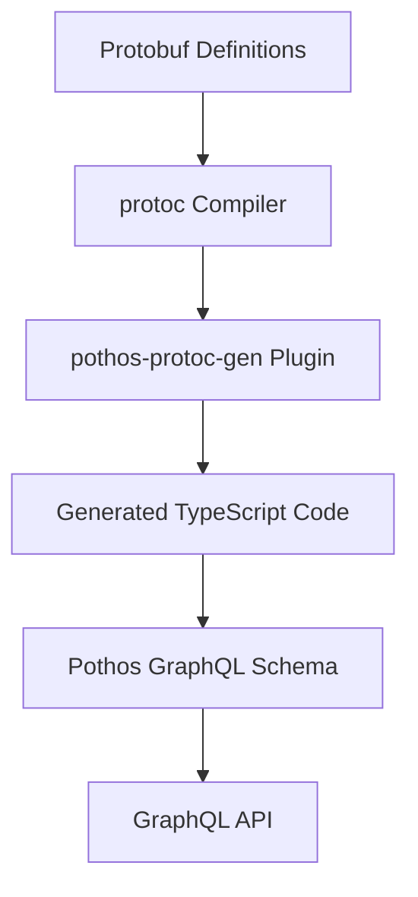

# System Patterns: pothos-protoc-gen

## Architecture Overview
pothos-protoc-gen follows a plugin-based architecture that integrates with the Protocol Buffer compiler (protoc). The system processes protobuf definitions and generates TypeScript code for Pothos GraphQL schema.

## Core Components

### Plugin Entry Point
The main entry point (`src/index.ts`) initializes the plugin and orchestrates the code generation process. It:
- Parses plugin options
- Collects information from protobuf files
- Generates file artifacts
- Creates global scalar mappings
- Builds the Pothos type registry

### Collection System
The collection system (`collect.ts` and related files) traverses the protobuf schema and extracts:
- Messages (input and output types)
- Enums
- Services and methods
- Dependencies between types

### Code Generation
The code generation components transform the collected protobuf information into TypeScript code:
- `generate-file-artifact.ts`: Creates TypeScript files for each protobuf file
- `generate-global-scalar-map-entries.ts`: Maps protobuf scalar types to GraphQL scalar types
- `generate-pothos-type-registry.ts`: Registers all types with the Pothos schema builder

### Type Mapping
The system includes utilities for mapping between protobuf and GraphQL types:
- Well-known type wrappers (e.g., Google's common types)
- Custom scalar mappings
- Complex type transformations

## Design Patterns

### Visitor Pattern
The collection system uses a visitor pattern to traverse the protobuf schema and extract relevant information.

### Builder Pattern
The code generation uses a builder pattern to construct TypeScript code from the collected information.

### Registry Pattern
The system maintains registries for:
- Global scalar mappings
- Type definitions
- Service methods

### Transformation Pipeline
The code generation follows a transformation pipeline:
1. Parse protobuf definitions
2. Collect type information
3. Transform to intermediate representation
4. Generate TypeScript code

## Key Technical Decisions

### TypeScript Code Generation
The plugin generates TypeScript code rather than GraphQL SDL to leverage the type safety and integration with Pothos.

### Pothos Integration
The system is designed specifically for Pothos, a code-first GraphQL schema builder, to provide a seamless developer experience.

### Service Mapping
The plugin maps protobuf services to GraphQL queries and mutations based on configuration options, allowing flexibility in API design.

### Type Safety
The generated code maintains type safety throughout, ensuring that the GraphQL schema accurately reflects the protobuf definitions.
